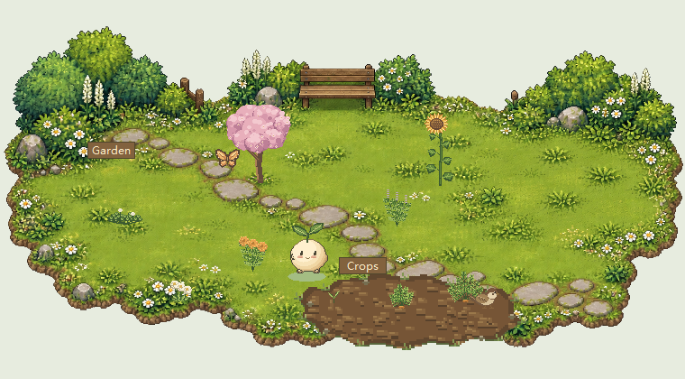

# 小芽桌面花园



一座陪你使用 Codex、随时间慢慢成长的像素桌面花园。

**Windows 测试版 · 0.1.0-beta.4**

[English](README.md) · **简体中文**

## 小芽是什么？

小芽是一个本地运行的 Codex 插件，带有像素桌面花园和圆滚滚的宠物伙伴。陪伴时间让宠物和植物成长，Codex 新记录的 token 用量为宠物补充劳动精力。不需要为了养宠物额外调用 AI。

## 主要功能

- **连续的像素花园。** 观赏植物、菜畦和草地位于同一个二维场景中。小芽会走到植物旁，播放对应的劳动动作。
- **挂机与离线成长。** 桌面花园运行时每小时获得 6 经验，离线每小时获得 3 经验，每次离开最多结算 12 小时。目前等级上限为 30 级，拥有四阶段外观。
- **Token 补充劳动精力。** 每 1,000 个可靠新增 token 补充 1 精力，上限 100。小芽消耗精力播种、浇水、施肥和收获；没有精力时植物仍会自然成长，不会枯萎。
- **种下即固定的随机种子。** 自动播种从对应区域已解锁的植物中随机选择，种下后品种固定，查看或重启不会重新抽取。
- **10 种植物、五阶段生长。** 随解锁条件满足，逐步种植三叶草、薄荷、雏菊、樱花树、向日葵、金盏花、胡萝卜、番茄、小萝卜和生菜。
- **植物科普信息卡。** 点击植物查看中英文简介与生长信息，区分真实植物知识和游戏内压缩后的成长规则。
- **收获、收藏与补种循环。** 精力足够时，小芽会收获成熟作物并补种空菜畦。成熟观赏植物可收藏后再摆回，也可开启自动轮换；轮换默认关闭。
- **花园小访客。** 记录成熟植物种类，逐步解锁蝴蝶和麻雀访客。
- **外观与桌面交互。** 点击小芽查看属性，通过手记查看成长、收藏和外观；支持中英文界面、配色主题、自定义 PNG 形象、拖动和窗口置顶。
- **本地存档。** 花园进度保存在自己的电脑上，无需游戏服务器，不包含联机对战。

## 扩展植物与素材

植物、宠物形态、动画、科普文案和场景资源使用统一的版本化内容包。新增普通植物只需 JSON 配置、分语言文案和五阶段 PNG，无需修改玩法代码。详见[内容扩展指南](plugins/codex-pet/CONTENT.zh-CN.md)。

## 许可证

本项目采用 [MIT 许可证](LICENSE)，允许商业使用、修改和再分发，需保留版权及许可证声明；软件不提供担保。除另有标注外，授权适用于本项目代码、文档及随附美术素材中版权人有权授权的部分。引用的外部资料仍遵循其自身条款。

## 环境与安装

需要 Windows 桌面环境、支持插件的 Codex 客户端、Python 3.10+（含 Tcl/Tk 和 `pythonw`），并将 Python 加入 PATH。下列命令还需要 Codex CLI、Git 和访问 GitHub 的网络。花园运行无需安装第三方 Python 包。

在 PowerShell 中执行：

```powershell
codex plugin marketplace add Jb-C-Lelouch/sprout-pet-beta
codex plugin add codex-pet@sprout-beta
```

重启 Codex，按提示审核并信任插件钩子，新建任务说 **“打开小芽花园”**。首次用量事件建立基线，不补记历史 token。

如果使用下载的 ZIP，完整解压后，在能看到本 README 和 `plugins` 文件夹的仓库根目录打开 PowerShell：

```powershell
codex plugin marketplace add .
codex plugin add codex-pet@sprout-beta
```

双击 `plugins/codex-pet/Check-Environment.cmd` 检查 Python/Tk 环境。同目录的 `Open-Desktop-Pet.cmd` 可以独立打开花园，但单独打开窗口不会替你安装或授权 Codex 用量钩子。

## 更新、存档与当前限制

执行 `codex plugin marketplace upgrade sprout-beta` 刷新市场，再在 Codex 中检查插件更新，重启花园并新建 Codex 任务。右键花园可退出。存档位于用户主目录的 `.codex-pet` 文件夹，备份前请关闭花园；卸载插件默认保留存档。

当前是早期 Windows 测试版，尚未内置 Python。Token 读取依赖宿主的本地 transcript 格式，兼容性可能随 Codex 版本变化；无法读取用量时仍可按时间成长。自动劳动仅在桌面花园运行时进行，离线不模拟劳动。收获仓库目前只记录数量，没有交易或货币系统。干净电脑安装与真实宿主钩子连接仍需更多测试。

钩子会读取本地 transcript 记录以提取会话标识和累计 token 数，不把对话正文复制进花园存档，也不上传到游戏服务器。详情见[隐私说明](PRIVACY.md)和[发布说明](RELEASE.md)。

遇到问题请在 [Issues](https://github.com/Jb-C-Lelouch/sprout-pet-beta/issues) 中提供插件、Windows、Python、Codex 版本，复现步骤和环境检查报错。无需上传聊天记录或完整存档。
